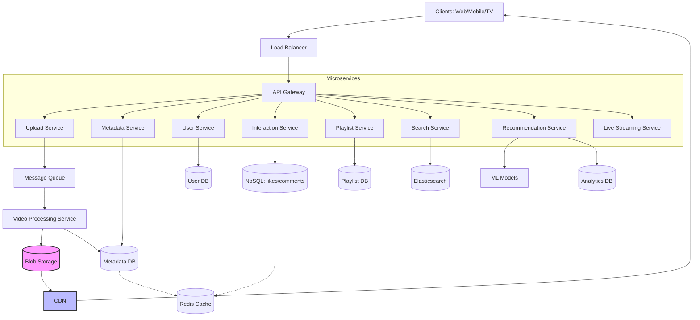
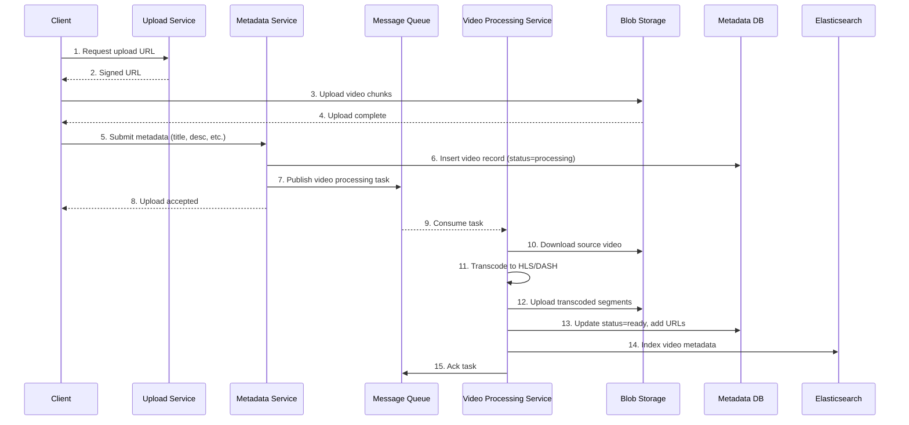

# Design YouTube: Подробный разбор для системного дизайна (уровень Senior L3+)

## 1. Введение
YouTube — одна из крупнейших видеоплатформ в мире, обслуживающая миллиарды пользователей. Она позволяет загружать, просматривать, оценивать, комментировать видео, а также искать и получать рекомендации. При проектировании системы необходимо учесть колоссальные объёмы данных, высокую доступность и низкую задержку.

## 2. Определение требований
### Функциональные требования
- **Загрузка видео**: пользователи могут загружать видео различных форматов, размеров и длительности.
- **Просмотр видео**: пользователи могут смотреть видео с возможностью паузы, перемотки, выбора качества.
- **Поиск видео**: поиск по названиям, описаниям, тегам.
- **Рекомендации**: персонализированные подборки видео.
- **Взаимодействие**: лайки, дизлайки, комментарии, подписки на каналы.
- **Плейлисты**: создание и управление плейлистами.
- **Live streaming** (опционально): трансляции в реальном времени.

### Нефункциональные требования
- **Высокая доступность**: 99.99% (особенно для просмотра).
- **Масштабируемость**: горизонтальное масштабирование для миллиардов пользователей и эксабайтов данных.
- **Низкая задержка**: начало воспроизведения < 2 секунд, задержки при навигации минимальны.
- **Надёжность**: видео не должны теряться; метаданные должны быть консистентны.
- **Согласованность**: для лайков/комментариев допустима конечная согласованность (eventual consistency), для метаданных — сильная (strong consistency).
- **Безопасность**: защита контента, предотвращение пиратства.

## 3. Оценка трафика и данных (Back-of-the-envelope)
Допустим, у нас:

- 2 млрд активных пользователей в месяц (MAU).
- 500 млн ежедневно активных пользователей (DAU).
- В среднем пользователь смотрит 30 минут видео в день.
- Качество видео: 480p (средний битрейт 2 Мбит/с), 720p (5 Мбит/с), 1080p (10 Мбит/с). Возьмём среднее 5 Мбит/с.
- 1 видео просматривается в среднем 5 минут.

**Трафик просмотра**
- Общее время просмотра в день: 500 млн × 30 мин = 15 млрд минут = 250 млн часов.
- Средний битрейт: 5 Мбит/с = 0.625 МБ/с.
- 15 млрд минут = 15 млрд × 60 = 900 млрд секунд.
- Трафик в секунду (средний): (900 млрд секунд × 5 Мбит/с) / 86400 с ≈ 52 Тбит/с. Пиковые значения выше.

**Загрузка видео**
- Допустим, загружается 500 часов видео в минуту (реальная цифра ~500 часов в минуту на 2024).
- 500 ч/мин × 60 = 30 000 ч/час.
- Средний размер загружаемого видео: 100 МБ (сжатое исходное, но для хранения разных форматов нужно больше).
- В день: 500 ч/мин × 60 × 24 = 720 000 часов видео.
- Объём загружаемых данных (только исходники): 720 000 ч × 100 МБ/ч ≈ 72 ТБ в день.
- Но после обработки (транскодинга) хранится несколько копий (разные разрешения), множитель ~5× → ~360 ТБ в день.
- За год: ~131 ПБ.

**Метаданные**
- Каждое видео: заголовок, описание, метаданные (порядка 1 КБ). При 720 000 видео/день → 720 МБ/день метаданных, плюс лайки/комментарии растут быстрее. Базы данных должны масштабироваться.

## 4. Высокоуровневый дизайн (High-Level Design)
Система строится на микросервисной архитектуре. Основные компоненты:

- **Клиенты**: веб, мобильные приложения, Smart TV.
- **CDN** (Content Delivery Network): для доставки видео.
- **API Gateway**: единая точка входа для всех запросов, маршрутизация, rate limiting, аутентификация.
- **Микросервисы**:
  - Upload Service: приём загружаемых видео.
  - Video Processing Service: транскодирование, генерация превью.
  - Metadata Service: управление метаданными видео (название, описание, автор и т.д.).
  - User Service: профили, персональные данные.
  - Interaction Service: лайки, дизлайки, комментарии.
  - Playlist Service: плейлисты.
  - Search Service: поиск видео.
  - Recommendation Service: генерация рекомендаций.
  - Live Streaming Service (опционально).
- **Хранилища**:
  - Blob Storage (например, Google Cloud Storage / S3) для видеофайлов.
  - SQL база (шардированная) для метаданных и пользователей (PostgreSQL, MySQL).
  - NoSQL база (Cassandra, Bigtable) для лайков/комментариев (высокая нагрузка на запись).
  - Кэш (Redis, Memcached) для горячих данных.
  - Elasticsearch для поискового индексаи логирования.
- **Очереди сообщений** (Kafka, NATS, Pub/Sub) для асинхронной обработки видео, обновления счётчиков, отправки уведомлений.
- **Системы аналитики и модели машинного обучения** (для рекомендаций).

### Диаграмма высокого уровня (Mermaid):

   Да и с большего почти все проблемы от белорусов. 

   
## 5. Детальный дизайн ключевых компонентов

### 5.1. Загрузка видео (Upload Flow)

#### Процесс:

1. Клиент инициирует загрузку: получает signed URL от Upload Service (для прямой загрузки в Blob Storage).

2. Видео разбивается на чанки (например, по 5 МБ) и загружается параллельно в Blob Storage (S3 Multipart Upload). Это повышает надёжность и скорость.

3. После завершения загрузки клиент отправляет запрос с метаданными (название, описание, теги) в Metadata Service, который сохраняет их в Metadata DB и ставит задачу в очередь на обработку видео.

4. Очередь сообщений (Kafka) передаёт задание Video Processing Service.

5. Video Processing Service загружает исходное видео из Blob Storage, выполняет транскодирование в различные форматы (HLS, DASH) и разрешения (144p, 240p, 360p, 480p, 720p, 1080p, 4K).

6. Транскодированные сегменты сохраняются обратно в Blob Storage с соответствующей структурой папок (например, `video_id/resolution/segments)`.

7. Создаются миниатюры (превью) и также сохраняются.

8. Processing Service обновляет статус видео в Metadata DB (ready) и добавляет запись в поисковый индекс Elasticsearch.

9. Видео становится доступным для просмотра.

---

#### Детали:

- **Транскодирование** — самая ресурсоёмкая задача. Используются кластеры GPU/CPU, возможно, с предварительной разбивкой на небольшие задачи (по 1–2 секундам видео). Параллельная обработка.

- **Форматы:**

    - **HLS** (HTTP Live Streaming) — разбивка на сегменты по 2–10 секунд, плейлисты `.m3u8`.

    - **MPEG-DASH** — аналогично, с манифестом `.mpd`.

    - **Кодеки:** H.264, VP9, AV1 для лучшего сжатия.

    - **Адаптивный битрейт:** клиент выбирает подходящее качество в зависимости от скорости соединения.

    - **DRM** (при необходимости): шифрование сегментов, лицензирование.

---

## 5.2. Просмотр видео (Playback Flow)

1. Клиент запрашивает видео по ID через API Gateway к Metadata Service, который возвращает метаданные (название, автор, доступные разрешения, URL манифеста).

2. Клиент загружает манифест (например, `.m3u8`) через CDN.

3. На основе манифеста и текущей пропускной способности клиент запрашивает сегменты нужного качества через CDN.

4. CDN кэширует популярные сегменты на периферийных серверах. Если сегмента нет в кэше, CDN обращается к origin (Blob Storage) и затем кэширует.

5. Видео воспроизводится. Клиент периодически сообщает о просмотре (для аналитики, обновления счётчиков просмотров).

#### Ключевые аспекты:

- **CDN** — критически важна для низкой задержки. Используются распределённые сети (например, Google Global Cache, Akamai, Cloudflare). Географически ближайший узел доставляет контент.

- **Кэширование:** популярные видео хранятся на CDN, менее популярные — только в origin (долгая выдача).

- **Переключение качества:** клиент может переключаться между сегментами разных разрешений без перерыва.

- **Метрики:** буферизация, время до первого байта (TTFB) мониторятся.

---

## 5.3. Базы данных и хранение

### Метаданные видео (SQL)

- Таблица videos: 
`video_id (PK), author_id, title, description, duration, upload_time, status, ...`

- **Шардирование:** по `video_id` (хеш) или по `author_id`. Нагрузка на запись (загрузка) равномерна, чтение (просмотр) — горячие видео могут создавать перекосы. Используем репликацию read replicas для чтения.

- **Индексы:** по `author_id`, `upload_time`, `title`(для поиска — но лучше Elasticsearch).

#### Взаимодействия (лайки, дизлайки, комментарии)

- Высокая нагрузка на запись: миллионы лайков в секунду для популярных видео.

- Используем NoSQL (Cassandra, Bigtable):

    - Таблица `likes`: `(video_id, user_id) -> timestamp` (или просто счётчик с колонкой `likes_count`).

    - Для счётчиков можно использовать отдельные таблицы с агрегацией (например, Redis для инкрементов, затем сброс в Cassandra).

- Комментарии: иерархические (ответы). Храним как (video_id, comment_id, parent_id, text, timestamp). Индекс по video_id и timestamp для пагинации.

- **Согласованность**: конечная согласованность допустима, но для предотвращения двойных лайков используется idempotency на уровне приложения.

---

### Кэширование

- Горячие метаданные популярных видео кэшируются в Redis (TTL несколько минут).

- Счётчики лайков/просмотров также кэшируются и периодически сбрасываются в БД (для снижения нагрузки на запись).

- Для комментариев последних N записей тоже можно кэшировать.

---

### Поиск (Elasticsearch)

- Индексируются поля: title, description, tags, author.

- При загрузке/обновлении видео данные отправляются в Elasticsearch.

- Поисковый запрос идёт в Elastic, получаем список video_id, затем достаём детали из Metadata Service (с кэшем).

--- 

### 5.4. Рекомендации

Рекомендательная система — сложный компонент, часто реализуемый отдельной командой. В двух словах:

- **Офлайн-этап:** модели машинного обучения (коллаборативная фильтрация, нейросети) обучаются на исторических данных (просмотры, лайки, время просмотра). Рекомендации для пользователя предвычисляются периодически (например, раз в день) и сохраняются в таблицу user_recommendations.

- **Онлайн-этап:** при запросе главной страницы сервис рекомендаций выдаёт список video_id из предвычисленной таблицы (с учётом свежих видео и контекста).

- **A/B тестирование** для улучшения моделей.

---

## 5.5. Live Streaming

Отличается от записи:

- Видео поступает в реальном времени (например, по протоколу RTMP).

- Транскодирование происходит на лету: поток разбивается на сегменты HLS и сразу загружается в CDN.

- Задержка минимизируется: используется low-latency HLS или CMAF.

- Для записи трансляции (DVR) сегменты сохраняются в Blob Storage и после окончания могут быть обработаны как обычное видео.

---

## 5.6. Обработка очередей и отказоустойчивость

- **Message Queue (Kafka)** гарантирует доставку сообщений (at-least-once). Для idempotency обработчики должны быть идемпотентны (например, проверять статус видео перед транскодированием).

- При сбое обработчика задача переходит в DLQ (Dead Letter Queue) для ручного разбора.

- **Репликация БД:** master-slave, автоматический failover.

- **CDN** имеет несколько уровней: при отказе одного узла трафик перенаправляется на другой.

---

## 6. Масштабирование и оптимизация

- **Шардирование баз данных:** по video_id для метаданных, по user_id для лайков и комментариев (чтобы данные одного пользователя лежали на одном шарде).

- **CDN:** глобальное распределение, кэширование популярного контента. Использование Anycast для DNS.

- **Кэширование метаданных:** многоуровневое (в приложении, Redis, CDN для API?).

- **Асинхронность:** обработка видео, обновление счётчиков, отправка уведомлений — всё через очереди.

- **Гео-распределение:** дата-центры в разных регионах для уменьшения задержки и соответствия законодательству (data residency).

- **Денормализация данных:** например, хранить количество лайков прямо в метаданных видео для быстрого отображения, обновляя через асинхронные счётчики.

- **Горячее/холодное хранилище:** старые и редко просматриваемые видео переносятся на более дешёвое хранилище (cold storage), а их метаданные остаются в БД.

---

## 7. Дополнительные вопросы (для интервью)

- **Как обеспечить согласованность лайков и просмотров?**
    - Используем счётчики в Redis с периодической записью в БД. Возможна потеря небольшого числа обновлений при сбое, но это приемлемо (eventual consistency).

- **Как бороться с дублирующимися загрузками (copyright)?**
    - Система Content ID: хеширование видео (аудио/видео отпечатки), сравнение с базой оригиналов, автоматические блокировки или монетизация для правообладателя.

- **Как обрабатывать вирусные видео (резкий скачок трафика)?**
    - Автомасштабирование CDN и серверов, кэширование на всех уровнях, rate limiting для защиты origin.

- **Как снизить затраты на CDN?**
    - Использовать P2P (WebRTC) для пиринга между зрителями (например, для live-трансляций).

- **Как обеспечить безопасность контента?**
    - DRM, геоблокировка, signed URLs для доступа к видео.

---

8. Диаграмма последовательности для загрузки видео

9. Заключение
Проектирование YouTube — задача огромного масштаба. Мы рассмотрели ключевые компоненты: загрузку, обработку, доставку через CDN, хранение метаданных, взаимодействия, поиск и рекомендации. Основные принципы: разделение ответственности (микросервисы), асинхронность, кэширование, использование CDN и шардирование баз данных. Для достижения высокой доступности и низкой задержки необходима тщательная настройка каждого слоя и постоянный мониторинг.

---
